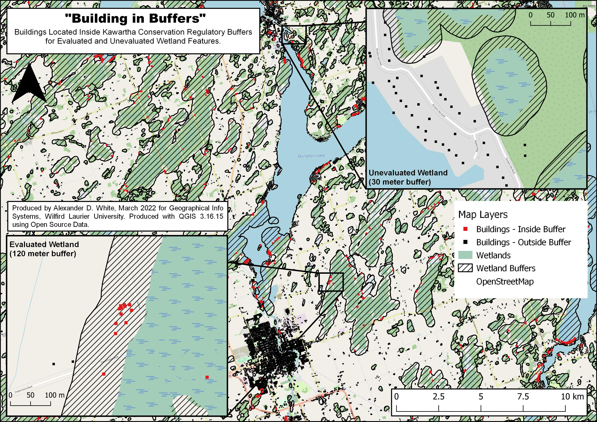

# Kawartha Lakes - Wetland Buffer Mapping

<https://anderwhite.github.io/KawarthaMap/>

These files are part of assignment for the GG369 - Geographic Information Systems class at Wilfrid Laurier University, Ontario, Canada. This project uses GQIS, OpenStreetMaps and OpenGov (Ontario GeoHub) data.

The purpose of this map is to identify all the buildings within the map extent that are within the a set buffer size around wetland features. Kawartha Conservation regulation policies are used as technical reference for determining buffer sizes (Evaluated Wetland = 120 meter, Unevaluated Wetlands = 30 meter).See Process Walkthrough (Below) for more details. This information could be used to identify areas where Sediment and erosion control measures are required, or where particular environmental polices are relevant. This map is a scaled down, non interactive, version of what most Conservation Authorities Use/provide through their online Conservation Mapping (ESRI). 

### To Download these files select the latest version from "Releases" on the side bar ------> 

## Statistics
Buildings - Inside Wetland Buffers = 2,832  
Buildings - Outside Wetland Buffers = 44,079  
Evaluated Wetlands = 1,128  
Unevaluated Wetlands = 2,763  

## Static Map

## Process Walkthrough
- Add XYZ Layer (OpenStreetMap)
- Define Map Extent
     - Create New ShapeFile Layer (Polygon)
     - Edit Feature, Add Polygon Feature, Create Square.
     - Rename "Map Boundary"
- Add Source Layers
    - Ont_Wetlands.shp
    - Ont_Waterbodies.shp
    - Ont_Buildings.shp
    - Reproject from WGS 84 to NAD83 17N (Required for accurate buffering)
- Clip Each Layer to "Map Boundary".
- Separate Evaluated and Unevaluated wetlands
    - Duplicate "Ont_Wetland" Layer
    - Rename "Evaluated Wetland" and "Unevaluated Wetland"
    - Open Attribute table for "Evaluated Wetland", Toggle Editing
    - Filter Features for "Unevaluated", Select Features, Delete Selected Features
    - Repeat for "Unevaluated Layer"
- Create Wetland Buffers
    - Create 120m Buffer for "Evaluated Wetland" 
    - Create 30m Buffer for "Unevaluated Wetland"
    - Find Difference of Evaluated and Unevaluated buffers to remove overlap
    (Plan was to show buildings in 30m and 120m buff separately, Map too crowded, no real benefit, VETO'd)
    - Merge Evaluated Buffer with result of difference Layer, rename "Wetland Buffers"
- Separate Buildings based on buffer
    - Find Difference between "Ont_Buildings" and "Wetland Buffers", Rename Result "Buildings - Outside Buffer"
    - Clip "Ont_Buildings" with "Wetland Buffers", Rename Result "Buildings - Inside Buffer"
- Create Map Layout
    - Self Explanatory...

## Source Layers
- Ontario Hydro Network (OHN) - Waterbody  
 (https://geohub.lio.gov.on.ca/datasets/mnrf::ontario-hydro-network-ohn-waterbody/about) 
- Ontario Wetland Evaluation Systems - Wetlands  
 (https://geohub.lio.gov.on.ca/datasets/mnrf::wetlands/about) 
- Ontario MNRF - Building as Symbol  
 (https://geohub.lio.gov.on.ca/datasets/mnrf::building-as-symbol/about) 
