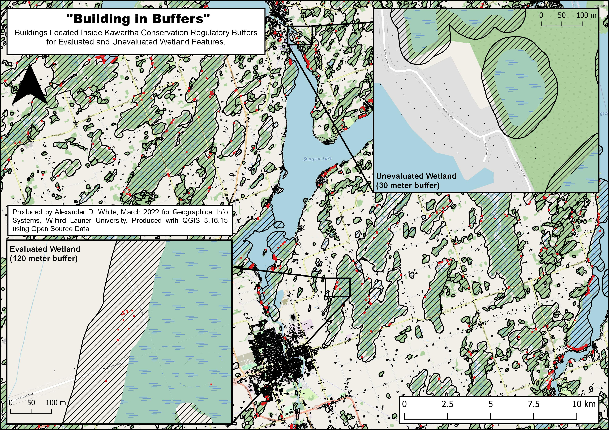

# Kawartha Lakes Wetland Buffer Map

These files are part of a assignment for the GG369 - Geographic Information Systems class at Wilfrid Laurier University, Ontario, Canada. The project uses GQIS, OpenStreetMaps and OpenGov (Ontario GeoHub) data. Wetland Buffers use Kawartha Conservation (https://www.kawarthaconservation.com) regulation policy standards. 

## Map

###  Map Walkthough

Source Layers:
- Ontario Hydro Network (OHN) - Waterbody (https://geohub.lio.gov.on.ca/datasets/mnrf::ontario-hydro-network-ohn-waterbody/about)
- Ontario Wetland Evaluation Systems - Wetlands (https://geohub.lio.gov.on.ca/datasets/mnrf::wetlands/about)
- Ontario MNRF - Building as Symbol (https://geohub.lio.gov.on.ca/datasets/mnrf::building-as-symbol/about)

Proccess Walkthrough:
- Add XYZ Layer (OpenStreetMap)
- Define Map Extent
     - Create New ShapeFile Layer (Polygon)
     - Edit Feature, Add Polygon Feature, Create Square.
     - Rename "Map Boundary"
- Add Source Layers
    - Ont_Wetlands.shp
    - Ont_Waterbodies.shp
    - Ont_Buildings.shp
- Data Management Tools > Reproject Layers
    - Reproject from WGS 84 to NAD83 17N (Required for accuate buffering)
- Clip Each Layer to "Map Boundary".
- Seperate Evaluted and Unevaulated wetlands
    - Duplicate Wetland Layer
    - 